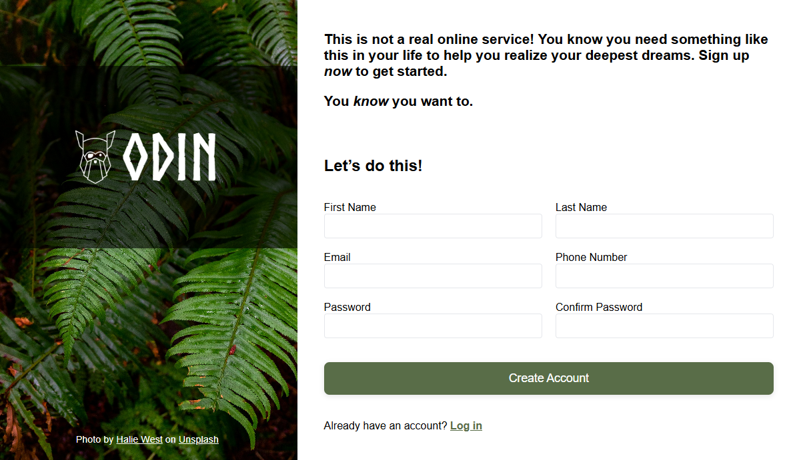

# Odin Sign-Up Form Project

## 📌 Overview
This is a sign-up form project from **The Odin Project** curriculum.  
It demonstrates HTML form structure, CSS styling for inputs and layout, and basic JavaScript for password validation.

The design includes:
- A left sidebar with a background image and logo.
- A right section with the sign-up form and introductory text.
- Password validation that checks if both fields match.

---

## 📖 Task Description

**From the assignment:**

> This project is intended to give you a chance to flex some of the new items you’ve been absorbing over the past few lessons. This time it’s a sign-up form for an imaginary service.
>
> ### Assignment Steps
> 1. **Set up and planning**
>    - Set up your Git repository.
>    - Link your HTML & CSS files.
>    - Plan your page layout from the design file.
>
> 2. **Gather assets**
>    - Background image (credit creator).
>    - Logo image.
>    - External font.
>
> 3. **Implementation details**
>    - Left section: background image + semi-transparent overlay for logo.
>    - Right section: introductory text + sign-up form.
>    - Password fields have red borders when invalid.
>    - Selected input has blue border & subtle shadow.
>    - “Create Account” button matches tones from background image (#596D48).
>    - Validate each field individually for now (JS for matching passwords optional).
>
> *No need to make the design responsive for mobile yet.*

---

## 🖼️ Project Preview

### **Final Result**

---

## ⚙️ Features Implemented
- **HTML5 form** with semantic labels and inputs.
- **CSS styling** with:
  - Grid layout for form fields.
  - Focus styles (`:focus`) for active inputs.
  - Invalid styles (`:invalid`) for incorrect inputs.
- **JavaScript validation**:
  - Checks if passwords match.
  - Displays red border when they don’t.
  - Clears error when fixed.
- **Assets used**:
  - Background image: *Photo by Halie West on Unsplash*.
  - Logo: Odin lined graphic.

---

## 📜 Credits
- **Background image**: [Halie West on Unsplash](https://unsplash.com/photos/green-fern-leaves-haliewest)
- **Logo**: The Odin Project resources
