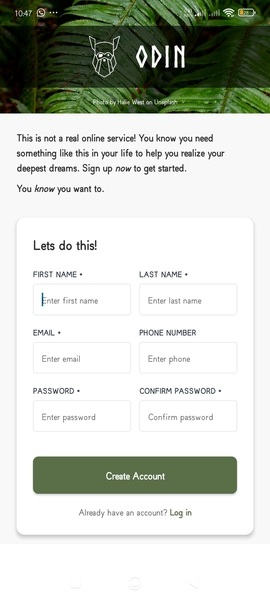

# Odin Sign-Up Form Mobile Project

## 📱 Overview

A mobile adaptation of **The Odin Project** sign-up form, transformed from a web application into a native mobile experience using React Native and Expo. This project demonstrates modern mobile development practices with clean architecture, TypeScript integration, and platform-optimized user experience.



---

## 🏗️ Project Architecture

Built with clean component architecture and separation of concerns for maintainable, scalable mobile development.

### Project Structure
```
odin-signup-mobile/
├── app/
│   └── index.tsx              # Main application entry
├── components/
│   ├── HeroSection.tsx        # Hero image and branding
│   ├── SignUpForm.tsx         # Form container and logic
│   ├── FormIntro.tsx          # Welcome text component
│   ├── FormFields.tsx         # Input fields layout
│   ├── InputField.tsx         # Reusable input component
│   └── SubmitButton.tsx       # Interactive submit button
├── types/
│   └── form.ts                # TypeScript type definitions
├── assets/
│   ├── images/
│   │   ├── halie-west.jpg     # Background image
│   │   └── odin-lined.png     # Logo asset
│   └── fonts/
│       └── Norse Bold.ttf     # Custom typography
└── constants/                 # App-wide constants
```

---

## 🛠️ Tech Stack


**Key Dependencies:**
- `expo-linear-gradient` - Background overlays
- `expo-font` - Norse Bold typography
- Native form validation & keyboard handling

---

## 🚀 Quick Start

```bash
# Install dependencies
npm install

# Start development server
npx expo start

# Run on platforms
npm run android    # Android
npm run ios        # iOS
```

---

## ✨ Mobile Features & Capabilities

### 🎨 Design & User Experience
- **Immersive Hero Section**: Full-screen background with elegant overlay and branding
- **Native Form Components**: Platform-optimized input fields with proper keyboard types
- **Visual Feedback**: Real-time validation with color-coded error states
- **Responsive Layout**: Adaptive design for various screen sizes and orientations

### 🔧 Technical Features
- **Component Architecture**: Modular, maintainable, and reusable component system
- **TypeScript Integration**: Full type safety with custom interfaces and type definitions
- **Form State Management**: Efficient state handling with React hooks
- **Cross-platform Compatibility**: Seamless experience on both iOS and Android
- **Font Loading**: Custom Norse Bold typography with proper loading states
- **Keyboard Handling**: Smart keyboard avoidance and scrolling behavior

### 📱 Mobile-Specific Enhancements
- **Touch Interactions**: Native touch feedback and gesture handling
- **Keyboard Types**: Contextual keyboards (email, phone, secure text)
- **Platform Adaptation**: iOS and Android design guideline compliance
- **Performance Optimization**: Efficient rendering and memory management
- **Accessibility**: Screen reader support and accessibility features

---

## 🎯 Development Highlights

### Architecture Benefits
- **Separation of Concerns**: Each component has a single, well-defined responsibility
- **Reusability**: Generic InputField component used throughout the form
- **Maintainability**: Clear file structure and consistent naming conventions
- **Scalability**: Easy to extend with additional fields or features
- **Testability**: Isolated components perfect for unit testing

### Code Quality
- **Type Safety**: Full TypeScript coverage prevents runtime errors
- **Clean Code**: Consistent formatting and naming conventions
- **Error Handling**: Comprehensive validation and error messaging
- **Performance**: Optimized rendering and state updates
- **Documentation**: Well-documented components and functions

---

## 📜 Credits

- **Background**: [Halie West on Unsplash](https://unsplash.com/photos/25xggax4bSA)
- **Original**: The Odin Project curriculum
- **Font**: Norse Bold typography

---

## 🔗 Auth Collection

Part of the **Authentication Screens Journey**:
- ✅ **Web Version** (HTML/CSS/JS)
- ✅ **Mobile Version** (React Native/Expo) - *This project*
- 🔄 **Future**: React, Vue.js, Node.js, Firebase